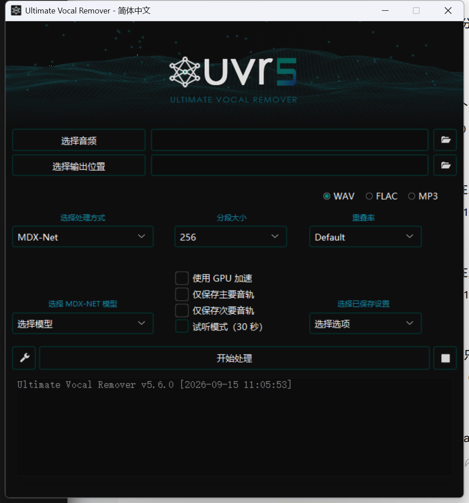

# Ultimate Vocal Remover GUI 简体中文版

这是 [Ultimate Vocal Remover GUI](https://github.com/Anjok07/ultimatevocalremovergui) 的非官方简体中文本地化版本，由 [ConfigCrate](https://configcrate.com/) 维护。

UVR 可以使用 AI 模型从歌曲中分离人声、伴奏、鼓、贝斯和其他音轨。项目及核心模型由原作者团队开发，本 Fork 仅提供中文界面与中文使用说明，不修改音频分离算法。



## 第一版汉化范围

- 主界面的按钮、标题和常用提示
- 选择输入音频与输出文件夹
- 开始、停止、完成和常见错误提示
- 模型下载中心的基础操作文字
- 中文字体适配

模型名称、MDX-Net、Demucs、VR Architecture 以及部分高级参数暂时保留英文，避免修改程序内部配置值。后续版本会逐步补充翻译。

> 当前仓库中的汉化代码属于首个测试版本。正式 Windows 安装包发布前，请以 Releases 页面说明为准。

## 最简单的使用方法

1. 点击“选择音频”，选中要处理的歌曲。
2. 点击“选择输出位置”，指定结果保存文件夹。
3. 在“选择处理方式”中选择 `MDX-Net`、`VR Architecture` 或 `Demucs`。
4. 选择对应模型。首次使用时可在设置中的“模型下载中心”下载模型。
5. 选择想要分离的音轨，例如 Vocals（人声）或 Instrumental（伴奏）。
6. 点击“开始处理”，等待进度完成。

如果只是想快速去除歌曲人声，建议先使用 MDX-Net 的常用人声模型。不同歌曲适合的模型不同，同一首歌可以尝试多个模型比较效果。

## 运行源码

本项目沿用上游 UVR v5.6 的运行环境，当前汉化版已在 Windows + Python 3.10 环境完成启动验证：

```powershell
python -m pip install -r requirements.txt
python UVR.py
```

依赖体积较大，因为其中包含 PyTorch、ONNX Runtime 和音频处理组件。完整的 Windows 安装包会在本仓库的 Releases 页面提供。

## 切换回英文

简体中文是本 Fork 的默认语言。如需临时使用原版英文界面，可以这样启动：

```powershell
$env:UVR_LANGUAGE="en"
python UVR.py
```

也可以使用命令行参数：

```powershell
python UVR.py --language=en
```

## 常见问题

### 没有可选模型

打开设置，在“模型下载中心”选择并下载模型。模型文件较大，下载时间取决于网络状况。

### 处理 MP3 时提示 FFmpeg 错误

程序处理非 WAV 文件时需要 FFmpeg。请安装 FFmpeg，或把 `ffmpeg.exe` 放入程序目录。

### 显存或内存不足

尝试降低 Segment（分段大小）或 Window Size（窗口大小），关闭其他占用显存的程序，或者改用 CPU 处理。

### 中文显示成方框

中文版默认使用 Windows 自带的“Microsoft YaHei UI（微软雅黑 UI）”。如果你在其他系统运行，可以在 UVR 的字体设置中选择支持中文的字体。

## 署名与许可证

- 原项目：[Anjok07/ultimatevocalremovergui](https://github.com/Anjok07/ultimatevocalremovergui)
- 核心开发者：[Anjok07](https://github.com/Anjok07)、[aufr33](https://github.com/aufr33)
- 中文本地化维护：[ConfigCrate](https://configcrate.com/)

本 Fork 保留上游完整 Git 历史、作者信息和项目署名。上游 README 声明 UVR 代码采用 MIT License；项目同时包含各自带有许可证声明的第三方组件，请继续遵守对应条款。

更完整的来源与中文化说明请查看 [NOTICE.md](NOTICE.md)。

本项目与 UVR 原作者没有官方隶属关系。有关音频分离算法或模型本身的问题，请优先查阅上游项目资料。
